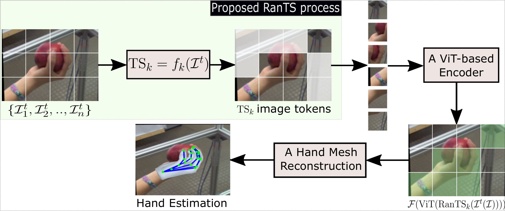

# RanTS: Random Token Sparsification
Code repository for the paper: Random Token Sparsification for ViT-based Hand Representation
<p align="left">
  <a href="https://github.com/phuongttn">Truong Thi Ngoc Phuong</a>,
  <a href="https://github.com/nttbdrk25">Thanh Tuan Nguyen</a>,
   <a href="https://github.com/nttbdrk25">Duy-Dinh Le</a>,
   <a href="https://github.com/nttbdrk25">Thanh Phuong Nguyen</a>,
</p>
<strong>Abstract:</strong> Transformer-based models have become the dominant paradigm for hand pose estimation (HPE) and hand mesh recovery (HMR) due to their strong capability in modeling global spatial relationships. However, they have been challenging in real deployments since the quadratic computational complexity of the transformer-based encoders leads to high training cost and scalability limitations. In consideration of the spatial distribution of hand pixels in real images, it can be realized that the hand region typically occupies a small fraction in the images. So, taking into account the whole spatial patterns of these images would be substantial redundancy for the token representation of the transformer encoders. To this end, Random Token Sparsification (RanTS) is proposed to eliminate a large proportion of the redundant tokens during training. Thereby, RanTS can sharply
reduce the computational cost of the token-based description while preserving the discriminative features for hand estimation.Experimental results have verified the efficacy of our simple strategy of token sparsification. For instance, with 25% rate of token elimination (i.e., one-fourth token reduction), RanTS for hand pose estimation obtained 84.2% AUC on HO3D-v2 [1], nearly the same 84.5% with full token representation, while the computational cost of RanTS is significantly decreased by about 11.83% training cost and 15% GPU RAM consumption. 

This project is developed based on the HaMeR \cite{pavlakos2024reconstructing} codebase. We thank the original authors for their open-source contribution.

## Key Differences from HaMeR
- Introduces Random Token Sparsification (RanTS) in the ViT encoder.
- Reduces redundant tokens during training without modifying the overall pipeline.
- Maintains comparable performance while improving computational efficiency.
<p align="left">
  
</p>

<p align="left">
  <em>Figure 1. Overview of the proposed RanTS process integrated into a ViT-based hand mesh reconstruction pipeline.</em>
</p>

## INSTALLATION
First you need to clone the repo:
```bash
git clone --recursive https://github.com/phuongttn/rants.git
cd rants
```
We recommend creating a virtual environment for RanTS. You can use venv:
```bash
python3.10 -m venv .rants
source .rants/bin/activate
```
or alternatively conda:
```bash
conda create --name rants python=3.10
conda activate rants
```
Then, you can install the rest of the dependencies:
```bash
pip install torch torchvision --index-url https://download.pytorch.org/whl/cu117
pip install -e .[all]
pip install -v -e third-party/ViTPose
```
You also need to download the trained models:
```bash
bash fetch_demo_data.sh
```
### DEMO
```bash
python demo.py \
    --img_folder example_data --out_folder demo_out \
    --batch_size=48 --side_view --save_mesh --full_frame
```
### TRAINING 
First, download the training data to ./hamer_training_data/ by running:
```bash
bash fetch_training_data.sh
```
Then you can start training using the following command:
```bash
python train.py exp_name=rants data=mix_all experiment=rants_vit_transformer trainer=gpu launcher=local
```
Checkpoints and logs will be saved to ./logs/.
### EVALUATION
Download the evaluation metadata to ./hamer_evaluation_data/. Additionally, download the FreiHAND, HO-3D, and HInt dataset images and update the corresponding paths in hamer/configs/datasets_eval.yaml.
Run evaluation on multiple datasets as follows, results are stored in results/eval_regression.csv.
```bash
python eval.py --dataset 'FREIHAND-VAL,HO3D-VAL,NEWDAYS-TEST-ALL,NEWDAYS-TEST-VIS,NEWDAYS-TEST-OCC,EPICK-TEST-ALL,EPICK-TEST-VIS,EPICK-TEST-OCC,EGO4D-TEST-ALL,EGO4D-TEST-VIS,EGO4D-TEST-OCC'
```
Results for HInt are stored in results/eval_regression.csv. For FreiHAND and HO-3D you get as output a .json file that can be used for evaluation using their corresponding evaluation processes.
## ACKNOWLEDGEMENTS 
Parts of the code are taken or adapted from the following repos:

- [4DHumans](https://github.com/shubham-goel/4D-Humans)
- [SLAHMR](https://github.com/vye16/slahmr)
- [ProHMR](https://github.com/nkolot/ProHMR)
- [SPIN](https://github.com/nkolot/SPIN)
- [SMPLify-X](https://github.com/vchoutas/smplify-x)
- [HMR](https://github.com/akanazawa/hmr)
- [ViTPose](https://github.com/ViTAE-Transformer/ViTPose)
- [Detectron2](https://github.com/facebookresearch/detectron2)
Additionally, we thank [StabilityAI](https://stability.ai/) for a generous compute grant that enabled this work.
## Open-Source Contributions
- [Wentao Hu](https://github.com/) integrated the hand parameters predicted by HaMeR into SMPL-X – [Mano2Smpl-X](https://github.com/)
## Citing
If you find this work useful, please consider citing:
```bibtex
@inproceedings{phuong2026rants,
  title={Random Token Sparsification for ViT-based Hand Representation},
  author={Phuong Truong and Thanh Tuan Nguyen and Duy-Dinh Le and Thanh Phuong Nguyen},
  booktitle={MAPR},
  year={2026}
}
### HaMeR
@inproceedings{pavlakos2024reconstructing,
    title={Reconstructing Hands in 3{D} with Transformers},
    author={Pavlakos, Georgios and Shan, Dandan and Radosavovic, Ilija and Kanazawa, Angjoo and Fouhey, David and Malik, Jitendra},
    booktitle={CVPR},
    year={2024}
}
